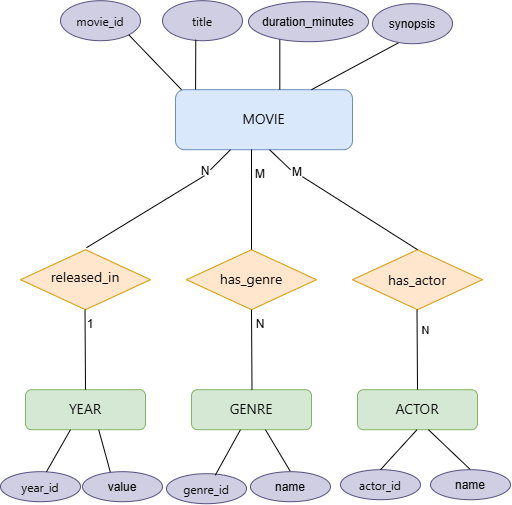
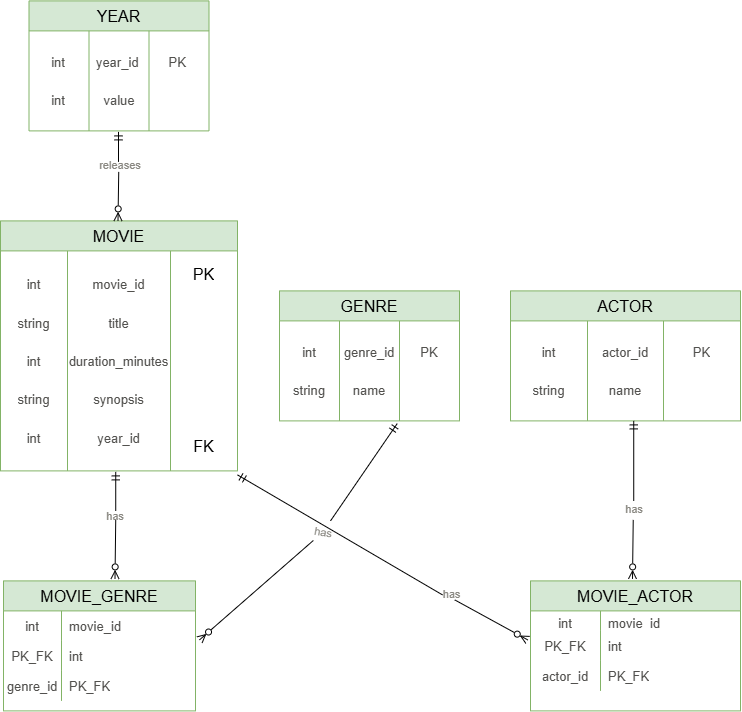

# API Movies

REST API for managing a movie catalog, built with Spring Boot. Developed as part of the Factoria F5 bootcamp (Spring & Spring Boot module).

## Technologies

- Java 17
- Spring Boot 4.1.0
- Spring Data JPA / Hibernate
- MySQL 8.0 (via Docker)
- Maven
- JUnit 5 + MockMvc + Mockito

## Data Model

The data model includes four entities — `Movie`, `Genre`, `Year`, and `Actor` — with the following relationships:
- **Movie ↔ Year**: many-to-one (each movie has exactly one release year)
- **Movie ↔ Genre**: many-to-many (via a `movie_genre` junction table)
- **Movie ↔ Actor**: many-to-many (via a `movie_actor` junction table)

### Chen ER Diagram


### Crow's Foot Diagram


## Prerequisites

- Java 17 or higher
- Docker Desktop
- Maven (or use the included `mvnw` wrapper)

## Setup

**1. Clone the repository**
```bash
git clone https://github.com/Raana-1375/ex-java-f5-api-movies.git
cd ex-java-f5-api-movies
```

**2. Start the MySQL database with Docker**
```bash
docker run --name mysql-api-movies -e MYSQL_ROOT_PASSWORD=root1234 -e MYSQL_DATABASE=api_movies -p 3307:3306 -d mysql:8.0
```

If the container already exists, start it with:
```bash
docker start mysql-api-movies
```

**3. Set environment variables**

The application reads database credentials from environment variables.

On Windows (PowerShell):
```powershell
$env:DB_USERNAME="root"
$env:DB_PASSWORD="root1234"
```

On macOS/Linux:
```bash
export DB_USERNAME=root
export DB_PASSWORD=root1234
```

**4. Run the application**
```bash
./mvnw spring-boot:run
```

The API will be available at `http://localhost:8080`.

## Endpoints

| Method | Endpoint | Description |
|---|---|---|
| GET | `/api/movies` | Get all movies |
| GET | `/api/movies/{id}` | Get a movie by ID |
| POST | `/api/movies` | Add a new movie |
| PUT | `/api/movies/{id}` | Update a movie |
| DELETE | `/api/movies/{id}` | Delete a movie |
| GET | `/api/movies/search?title=...` | Search movies by title |
| GET | `/api/movies/search?genre=...` | Search movies by genre |
| GET/POST/PUT/DELETE | `/api/genres` | CRUD for genres |
| GET/POST/PUT/DELETE | `/api/years` | CRUD for years |
| GET/POST/PUT/DELETE | `/api/actors` | CRUD for actors |

### Example: Create a movie

```json
POST /api/movies
{
  "title": "Forrest Gump",
  "durationMinutes": 142,
  "synopsis": "The story of a man with a low IQ who achieves great things in life.",
  "yearId": 1,
  "genreIds": [1],
  "actorIds": [1]
}
```

## Running Tests

```bash
./mvnw test
```

Tests include:
- Context load test for the Spring Boot application
- MockMvc tests for `MovieController` (GET all, GET by ID, DELETE), using Mockito to mock the service layer

## Project Structure

```
src/main/java/com/f5/apimovies/
├── controller/     # REST endpoints
├── service/        # Business logic
├── repository/     # Spring Data JPA repositories
├── entity/         # JPA entities
├── dto/            # Data transfer objects
└── ApiMoviesApplication.java
```